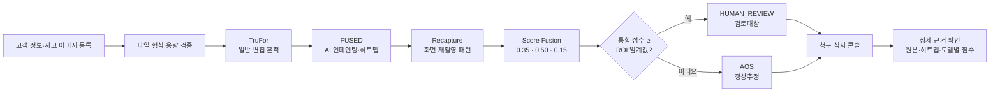
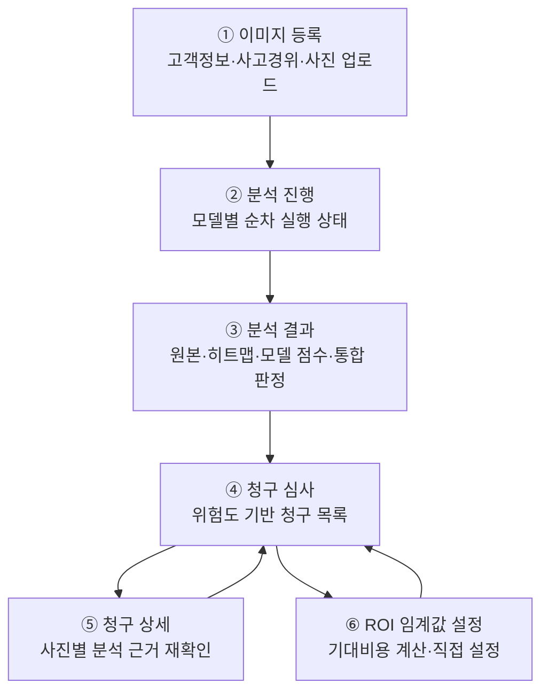
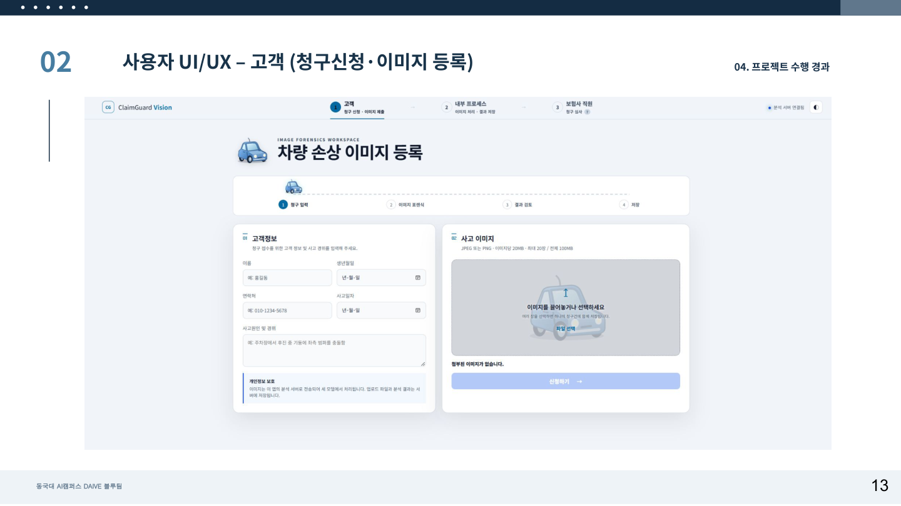
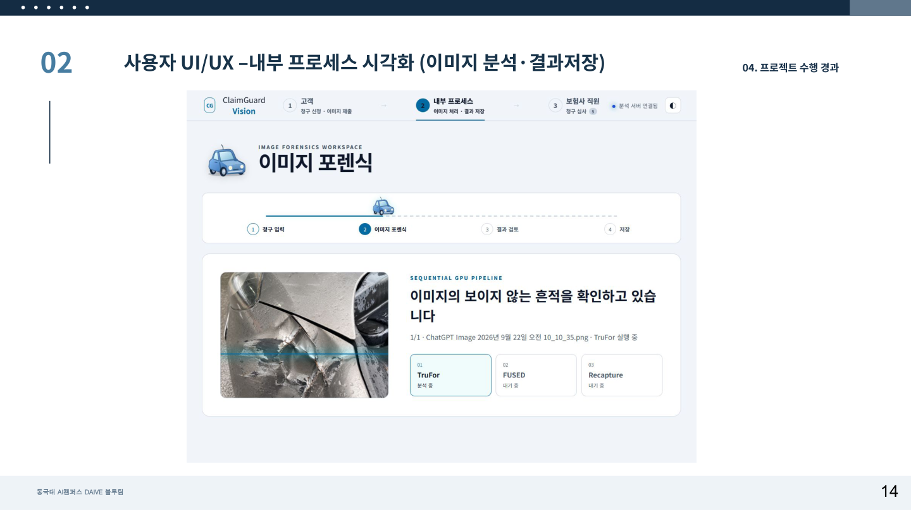
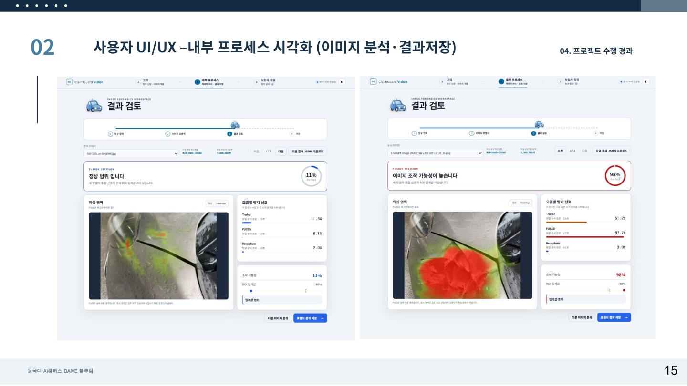
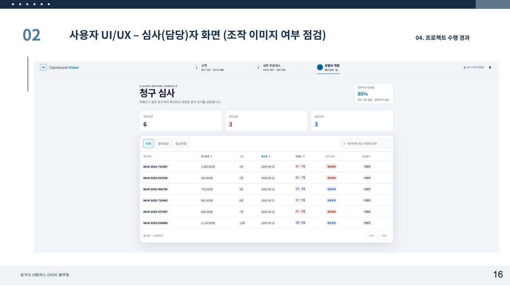
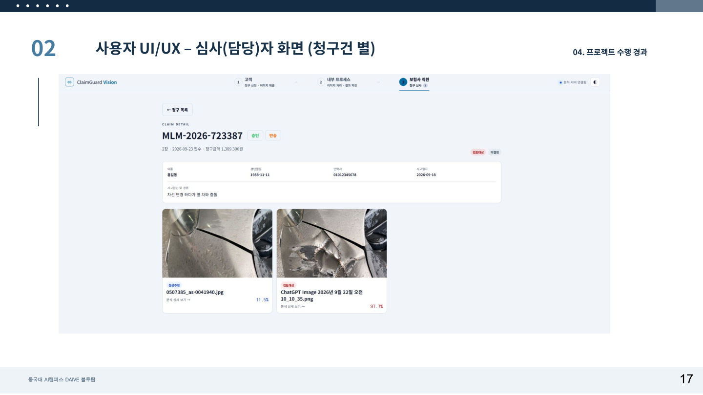
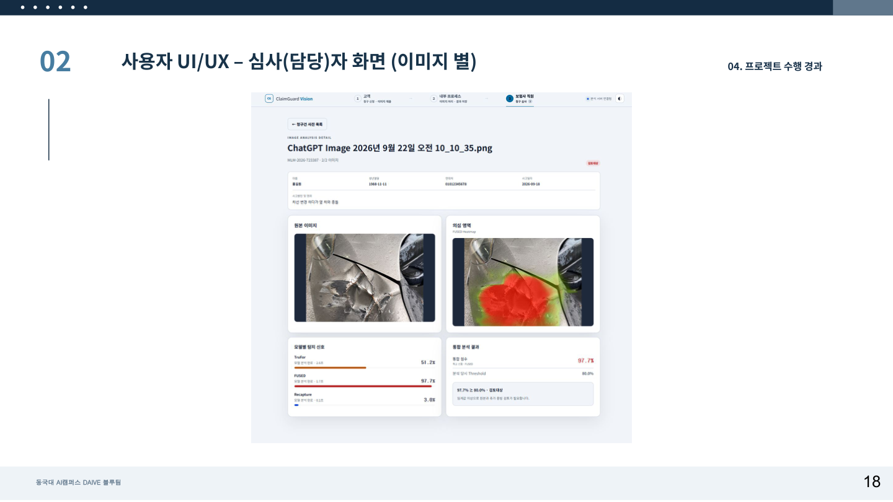

# ClaimGuard Vision

자동차보험 청구 사고사진의 AI 인페인팅, 일반 편집, 화면 재촬영 흔적을 분석하고 심사 우선순위를 제안하는 실행형 프로토타입입니다.

## 1. 기술 스택

| 구분 | 기술 | 역할 |
|---|---|---|
| UI | Streamlit, HTML, CSS, JavaScript | 이미지 접수, 분석 진행·결과 표시, 청구 심사 콘솔 |
| Backend | Python, Streamlit Components | 브라우저 UI와 추론 파이프라인의 양방향 연결 |
| Image Processing | Pillow, NumPy, OpenCV | 이미지 검증·전처리 및 결과 시각화 |
| AI Runtime | PyTorch, TorchVision, CUDA | 모델 학습 및 GPU 추론 |
| 조작 탐지 | TruFor | 일반 편집 흔적과 경계 탐지 |
| AI 인페인팅 탐지 | FUSED / OpenSDI | 생성형 AI로 수정된 영역의 점수와 히트맵 생성 |
| 재촬영 탐지 | DINOv2 with Registers | 모니터·화면 재촬영 패턴 탐지 |
| 계약·검증 | JSON Schema, unittest | 모델 공통 입출력 검증과 핵심 로직 테스트 |
| 실행 환경 | Windows PowerShell, WSL, Python 가상환경 | 앱 실행 및 모델별 의존성 격리 |

세 모델은 서로 요구하는 라이브러리 버전이 다르므로 독립 Python 환경에서 실행합니다. 자세한 설치 방법은 [`MODEL_SETUP.md`](MODEL_SETUP.md)를 참고하세요.

## 2. 전체 실행 흐름



`backend/model_gateway.py`가 **TruFor → FUSED → Recapture** 순서로 모델을 실행합니다. GPU 연산은 동시에 수행하지 않으며, 세 모델이 모두 정상 완료된 경우에만 통합 점수와 판정 결과를 생성합니다.

## 3. 구성 화면



| 화면 | 주요 내용 |
|---|---|
| 이미지 등록 | 고객 정보와 사고 경위를 입력하고 JPEG/PNG 이미지를 최대 20장까지 등록 |
| 분석 진행 | TruFor, FUSED, Recapture의 현재 실행 단계와 진행 상태 표시 |
| 분석 결과 | FUSED 의심 영역 히트맵, 모델별 점수, 통합 점수와 판정 경로 표시 |
| 청구 심사 | 저장된 청구건을 검토대상·정상추정·분석 미완료로 구분하여 조회 |
| 청구 상세 | 원본/히트맵 전환, 사진별 점수와 분석 당시 임계값 확인 |
| ROI 임계값 설정 | 검토비용과 미탐지 손실을 바탕으로 권장 임계값 계산 또는 직접 입력 |

### 실제 UI 화면

| 이미지 등록 | 분석 진행 |
|---|---|
|  |  |
| **분석 결과** | **청구 심사 목록** |
|  |  |
| **청구건 상세** | **이미지별 상세** |
|  |  |

화면 이미지는 [`차량파손이미지 포렌식 시스템 결과보고서.pdf`](차량파손이미지%20포렌식%20시스템%20결과보고서.pdf)의 13~18쪽에서 추출했습니다.

> 실제 UI는 Streamlit에서 `dist/index.html`을 양방향 컴포넌트로 제공합니다. HTML 파일만 직접 열면 화면 흐름을 둘러볼 수 있지만 실제 모델 추론은 실행되지 않습니다.

## 4. 5분 실행

Windows PowerShell:

```powershell
Set-ExecutionPolicy -Scope Process Bypass
.\scripts\setup_windows.ps1
.\scripts\run_windows.ps1
```

설치 없이 화면만 확인하려면 `dist/index.html`을 브라우저로 엽니다. 이 정적 데모는 업로드·결과·심사 콘솔 흐름을 확인하기 위한 것으로, 점수는 브라우저 내부의 결정적 시뮬레이션입니다.

## 5. 패키지 구성

```text
app/                 Streamlit 과제용 분석 + 업무담당자 콘솔
backend/             순차 모델 실행, score fusion, ROI 판정, 결과 저장
models/              TruFor/FUSED/Recapture 실행 진입점과 폴백
vendor/              TruFor·FUSED 공식 저장소
downloads/           Recapture DINOv2 base backbone
training/            501세트 규칙 기반 FUSED 학습 파이프라인
contracts/           모델 공통 JSON 입출력 계약
config/              런타임 설정
scripts/             설치·실행·점검·패키징 스크립트
tests/               핵심 로직 테스트
dist/                팀 공유용 브라우저 데모
weights/             가중치 배치 위치와 상태 명세
```

## 6. 가중치에 관한 중요한 사실

사용자가 제공한 `models.zip`의 체크포인트를 `weights/`에 반영했습니다. `scripts/check_weights.py`는 **파일 존재**와 **공식 추론 실행 가능 상태**를 따로 검사합니다.

| 모델 | 기본 경로 | 가중치가 없을 때 |
|---|---|---|
| TruFor | `weights/trufor/finetuned/best.pth.tar` | 공식 저장소·CUDA가 없으면 ELA + 노이즈 잔차 폴백 |
| FUSED | `weights/fused/finetuned/latest.pth` | 공식 `eval.opensdi` 구현·CUDA가 필요 |
| Recapture | `weights/recapture/best_screen_detector_*.pt` | DINOv2 base backbone·CUDA가 없으면 FFT 폴백 |

공식 TruFor 코드, 공식 FUSED 코드, Recapture용 DINOv2 base backbone도 프로젝트에 포함했습니다. 따라서 소스·체크포인트 자산은 모두 준비된 상태입니다. 실제 공식 추론에는 모델별 Python 의존성과 CUDA 환경이 추가로 필요합니다. 폴백 결과는 JSON의 `meta.backend`와 `meta.is_official_model=false`에 표시되어 실제 모델 결과와 혼동되지 않습니다.

## 7. FUSED 30-epoch 파인튜닝 (WSL 권장)

요구사항 시트의 규칙을 그대로 지원합니다. 모든 이미지는 학습 시 512×512로 변환합니다.

```text
data/
  f_bmp01_1_org.jpg
  f_bmp01_2_edi.png
  f_bmp01_3_msk.png
```

지원 부위: 앞범퍼, 앞펜더, 전조등, 뒷범퍼, 뒷펜더, 앞도어, 뒷도어, 사이드미러, 본넷, 트렁크. 명세 수량은 총 501세트입니다.

프로젝트를 WSL의 `/home/ai/새폴더`에 복사하고, 압축을 푼 학습 이미지를 프로젝트 내부 `data/fused_source/`에 넣습니다. 그다음 인자 없이 실행합니다.

```bash
cd /home/ai/새폴더
bash scripts/fused_wsl_all_in_one.sh
```

설정은 30 epochs, 전체 FUSED 구조, 8GB VRAM 안전 프로필로 고정되어 있습니다. 데이터 누수·손상 파일·빈 마스크·OOM 사전 조건·과열·디스크 부족·중단 후 재개까지 자동 점검합니다.

## 8. 실제 모델 연결

각 모델은 독립 Python 환경에서 실행되고 stdout 마지막 줄에 `contracts/model_io_schema.json` 형식의 JSON을 출력해야 합니다. 다음 환경 변수로 인터프리터와 가중치를 지정합니다.

```text
CG_TRUFOR_PYTHON
CG_FUSED_PYTHON
CG_RECAPTURE_PYTHON
CG_TRUFOR_CHECKPOINT
CG_FUSED_CHECKPOINT
CG_RECAPTURE_CHECKPOINT_DIR
```

앱 프로세스는 모델을 직접 import하지 않습니다. `backend/model_gateway.py`가 TruFor → FUSED → Recapture를 순차 실행하며, GPU 연산은 동시에 수행하지 않습니다.

FUSED는 첫 요청에서만 체크포인트를 로드한 뒤 전용 프로세스에 상주하며, 이후 요청은 같은 프로세스를 재사용합니다. 기본/파인튜닝 비교처럼 체크포인트가 바뀌면 기존 서버를 종료하고 선택한 체크포인트로 자동 재시작합니다. 문제 진단을 위해 예전의 요청별 실행 방식이 필요하면 앱 실행 전에 `CG_FUSED_PERSISTENT=0`을 지정할 수 있습니다.

모델별 WSL 환경 구성은 `MODEL_SETUP.md`를 참고하세요.

## 9. 검증

```powershell
.\.venv\Scripts\python.exe scripts\check_weights.py
.\.venv\Scripts\python.exe scripts\smoke_test.py
.\.venv\Scripts\python.exe -m unittest discover -s tests -v
```

## 10. 판정 원칙

- 기본 score fusion: TruFor 0.35 + FUSED 0.50 + Recapture 0.15
- 기본 ROI 임계값: 0.63
- 임계값 이상: `HUMAN_REVIEW`
- 임계값 미만: `AOS`
- 결과는 보험사기 확정 판정이 아니라 추가 검토 지원 정보입니다.
